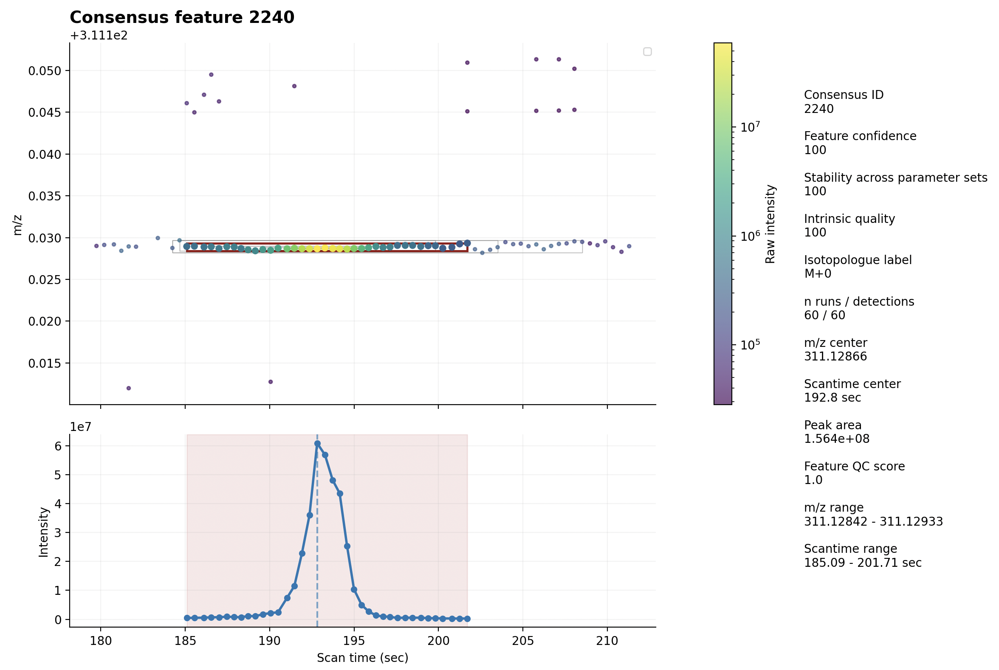

### msmate

`msmate` is a Python framework for exploratory LC–MS data analysis and feature detection in untargeted metabolomics.

The project focuses on confidence-aware LC–MS feature detection using density-based clustering (`DBSCAN`) combined with consensus scoring across multiple parameter sets.

## Why msmate?

Feature detection often receives comparatively little attention in untargeted LC–MS workflows, despite forming the basis for all downstream analyses.

In many metabolomics pipelines, statistical modelling is performed on large feature tables before metabolite identities are known. Features highlighted at later stages are then retrospectively inspected and annotated. As a result, unstable or inaccurately grouped LC–MS features may only become apparent near the end of the analysis workflow, at which point modelling and interpretation may need to be repeated.

`msmate` aims to make LC–MS preprocessing more transparent by exploring feature stability across multiple clustering parameterisations and deriving confidence scores from signal geometry, isotopic structure and cross-run reproducibility.

The package is built around modular processing components and additionally provides:

- mzML / mzXML import
- TIC, BPC and XIC generation
- isotope grouping utilities
- interactive visualisation of LC–MS features in m/z-retention time space
- consensus-based feature scoring and QC summaries

## Quick example
```python
from msmate.core.experiment import MsExperiment
from msmate.core.types import ScanWindow, DBSCANParams, QCParams
from msmate.isotopes.grouping import IsotopeFinder
from msmate.io.helpers_xml import inspect_msfile
from msmate.processing.parameter_optimisation import  score_runs, score_stability_fast

path = "mz_files/Urine_HILIC_ESIpos_msLevel1.mzXML"

# inspect mz(X)ML metadata
meta = inspect_msfile(path)

# define region of interest
roi = ScanWindow(
    mz_min=30,
    mz_max=1000,
    st_min=30,
    st_max=500,
)

# import MS1 data
exp = MsExperiment.from_mzfile(path, scan_window=roi)

# feature detection across parameter runs
runs, features = score_runs(exp, roi)

# consensus scoring
consensus, features = score_stability_fast(features, runs)

# visualise consensus feature
fig = exp.plot.consensus_feature(
    consensus_id=consensus.iloc[101]["consensus_id"],
    consensus=consensus,
    features=features,
)
```

## Example output

<p align="center">
  
</p>

`msmate` is currently under active development and serves both as a research playground for LC–MS algorithms and as a foundation for reproducible MS data processing workflows.

Feedback and suggestions are very welcome: torben@tkimhofer.dev